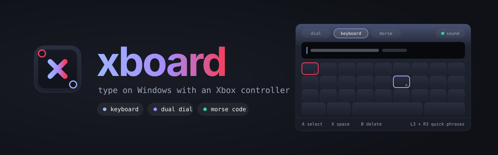
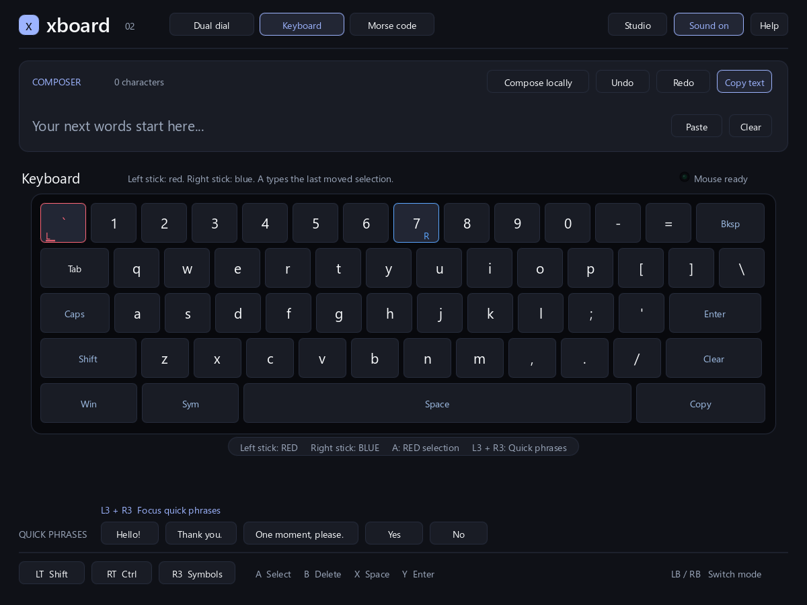
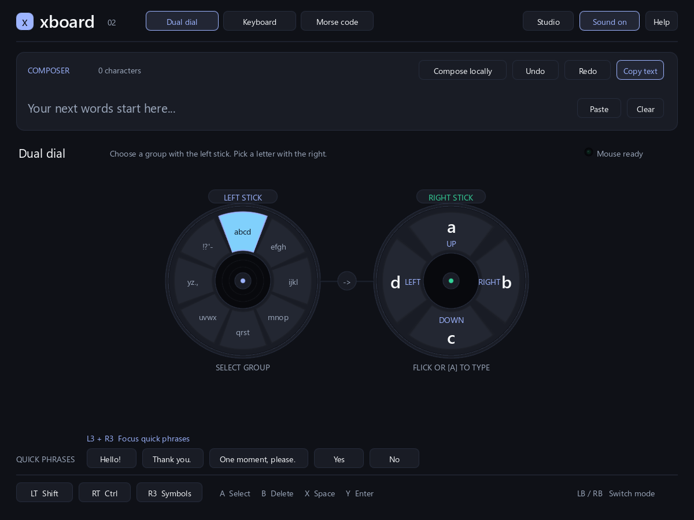
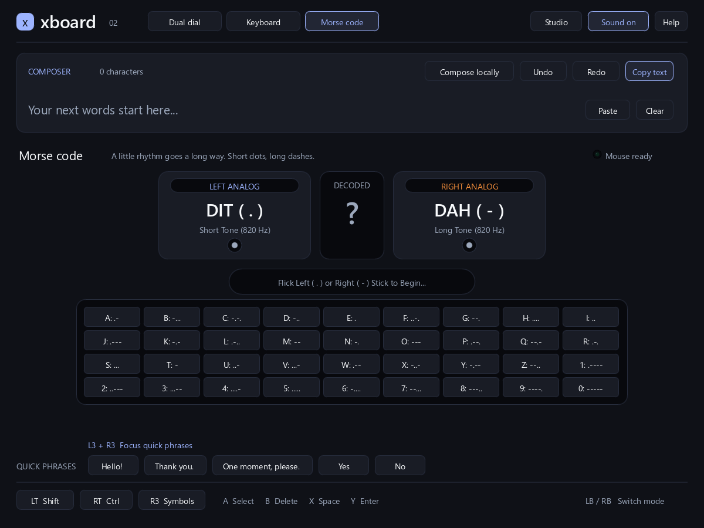
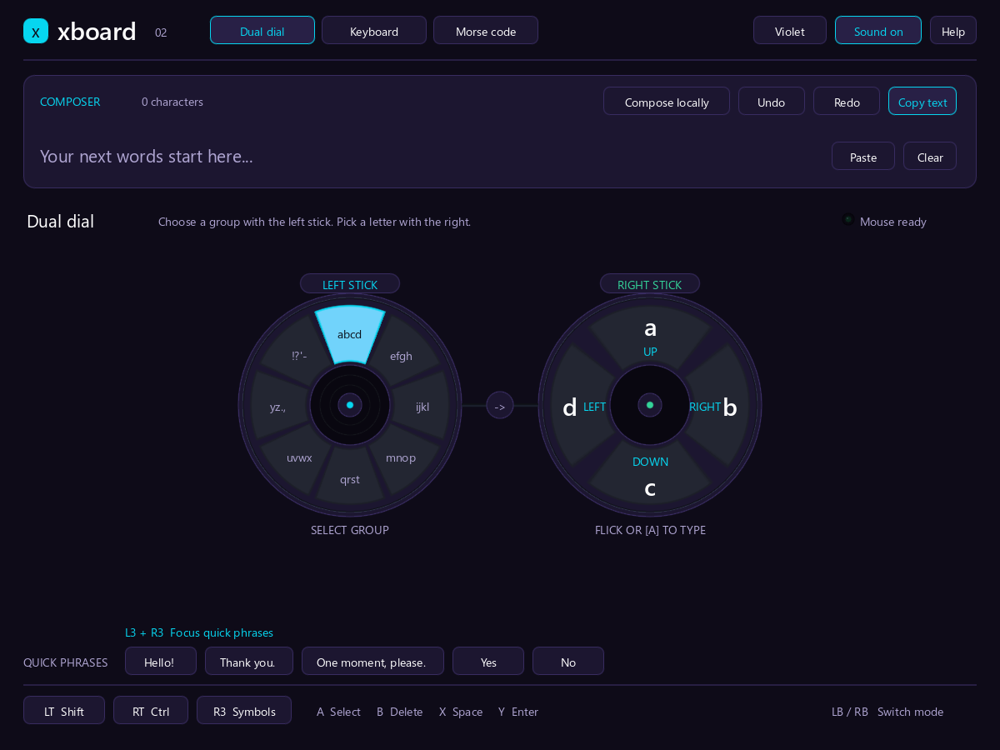
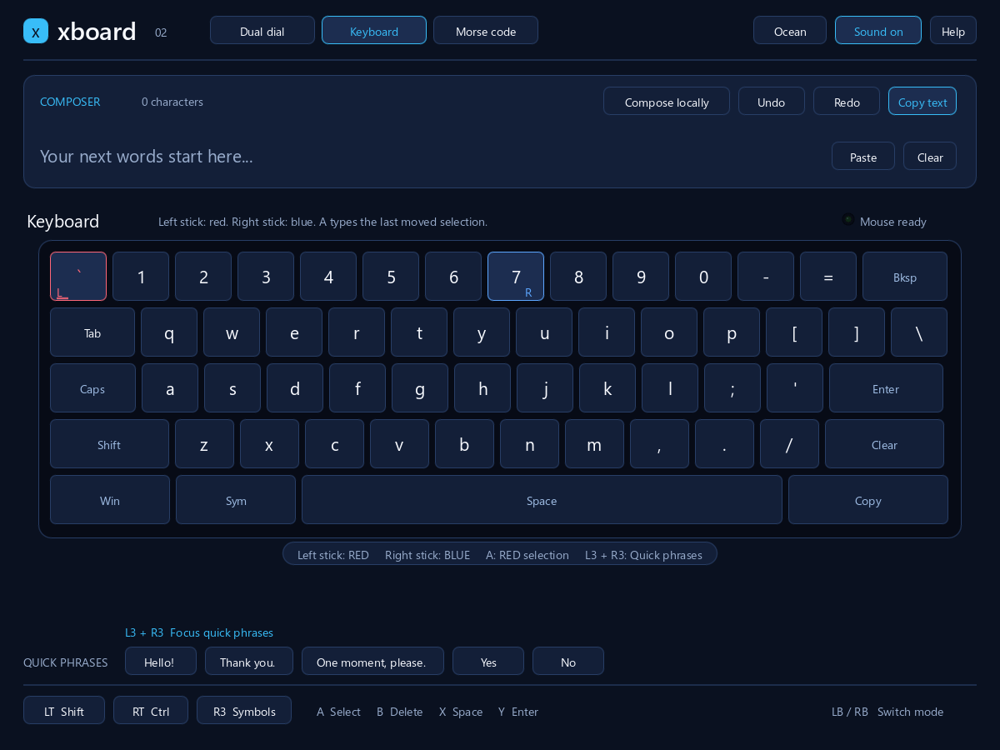
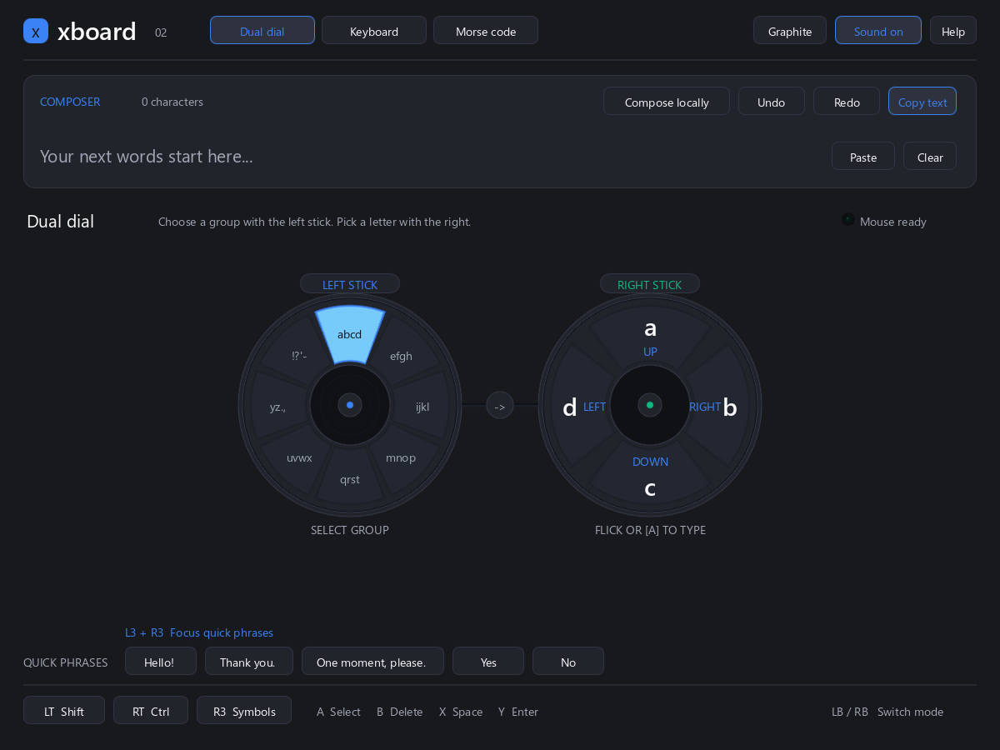

<p align="center">
  
</p>

# xboard Studio

A native Windows virtual keyboard for Xbox controllers and a mouse. Built in C11 with SDL2, SDL_ttf and XInput.

## Install

Download the latest `xboard-Setup-<version>.exe` from the [Releases page](https://github.com/fezcode/xboard/releases/latest) and run it. The installer targets `%PROGRAMFILES%\xboard`, offers Desktop and Start Menu shortcuts, and can remove its settings on uninstall. Nothing else is required — the app bundles its own runtime DLLs.

To build from source instead, see [Start here](#start-here).

## Screenshots

**Keyboard** — the left stick moves the red `L` selector, the right stick the blue `R` selector, and **A** activates whichever moved last.



**Dual dial** — choose one of eight groups with the left stick, then flick the right stick to type a character.



**Morse code** — left stick for a dot, right stick for a dash, with an 820 Hz tone and the full alphabet on screen.



### Themes

Four coordinated dark themes. **F2** or the title-bar button cycles them, and the choice is saved.

| Studio | Violet |
| --- | --- |
|  |  |

| Ocean | Graphite |
| --- | --- |
|  |  |

Regenerate every capture above with `xboard.exe --screenshot`, which renders one image per mode and theme and exits.

## Start here

```powershell
.\build.ps1 -Test -Run
```

Requires CMake 3.20+, Ninja, a C11 compiler, pkg-config, SDL2 and SDL2_ttf. The existing MinGW/MSYS2 environment is supported. Keep its `mingw64/bin` directory on PATH when building and running so Windows can find the runtime DLLs.

The executable is `build-studio/xboard.exe`. The build script resolves paths from its own directory, stops on configuration/build/test failures, and accepts `-Config Debug` and `-BuildDir <path>`.

## What's new

- Redesigned composer, mode navigation, focused key states, status indicators, help overlay and four coordinated dark themes.
- Local compose mode by default. Enable **Direct to apps** to type into the focused destination window.
- Real 32-step undo/redo, reversible clear, select-all replacement, word deletion at the cursor and UTF-8-aware character movement/deletion.
- Unicode clipboard copy/paste and Unicode direct text output. Paste and quick phrases are single undo operations. Oversized inserts are rejected without truncating text.
- Quick phrases, working sound toggle, and saved theme, mode and sound preferences.
- Press **L3 + R3 together** to focus quick phrases. Use either stick horizontally or D-pad left/right to choose; press **A** to insert. Press **L3 + R3 again** to return. Focus stays on phrases after insertion. Release both stick buttons between toggles.
- Corrected D-pad grid navigation, duplicated R3 toggling, conflicting L3 actions and mouse hover overriding controller focus.
- Text texture caching, separate editor/actions/interface modules and automated regression tests.

## Input modes

**Keyboard:** the left stick moves the red L selector; the right stick moves the blue R selector. Press A to activate the selector moved most recently. The D-pad moves the active selector. Fresh stick gestures take priority over repeats; exact simultaneous movements keep the previous active selector. Click keys with the mouse without moving either selector. Shift and symbols expose alternate characters.

**Dual dial:** choose one of eight groups with the left stick, then choose a character with the right stick. Flick the right stick to type once, then return it to center to re-arm. A also types the selected character. Left-stick group selection and gentle right-stick previews are silent. Both dials support clicking. In dual-dial mode, sound plays only after text is successfully inserted; navigation, deletion and other controls stay silent.

**Morse:** left stick for a dot, right stick for a dash. Press A to commit or wait 0.75 seconds. B removes an unfinished symbol first. Click either pad or an alphabet entry. Audio uses an 820 Hz tone with 75 ms dots and 225 ms dashes.

| Control | Action |
| --- | --- |
| A | Select / commit |
| B | Backspace; hold to repeat |
| X / Y | Space / Enter |
| LB / RB | Previous / next mode |
| LT / RT | Shift / Ctrl shortcuts |
| L3 + R3 | Toggle quick-phrase focus |
| L3 / R3 alone | Caps lock / symbols (on release) |
| View | Switch local/direct output |
| Menu | Copy composer |
| Guide | Windows key in direct mode |
| D-pad | Grid navigation; cursor movement in other modes |

With application keyboard focus: 1/2/3 select modes, Tab cycles modes, F1 toggles help, F2 changes theme, arrow keys move the text cursor, and Escape dismisses help or exits. The window uses Windows' no-activation behavior so clicking virtual keys preserves the destination app's focus.

## Composer behavior

The composer displays the cursor's current line and scrolls horizontally to keep it visible. Copy includes the complete text, including newlines. Capacity is 4,095 UTF-8 bytes. Character navigation follows Unicode code points, not combined grapheme clusters.

Local Ctrl+A selects all; the next insertion replaces it. Ctrl+C/V/X/Z/Y copy, paste, cut, undo and redo. Direct mode forwards controller Ctrl shortcuts to the destination app. The toolbar's Copy/Paste/Clear operate on the composer; Undo/Redo target the destination app when direct mode is enabled. The live output is a record of emitted text, not a synchronized view of the external document. External apps control their own undo history and may reject injected input, especially when elevated.

Preferences are stored in `SDL_GetPrefPath("xboard", "xboard")/preferences.ini` on normal exit. Composer text and direct-output mode are never persisted.

The file holds the theme, mode, sound toggle, window placement and your quick phrases:

```ini
theme=0
mode=1
sound=1
window=320,140,1200,900
phrase=Hello!
phrase=Thank you.
```

Edit the `phrase=` lines to define your own, up to eight of 39 characters each. Trailing spaces are kept, so `phrase=Hello! ` inserts the space too. Blank entries are skipped, and removing every `phrase=` line restores the built-in five. The row resizes itself to whatever you configure and always stays inside the window. Changes are picked up on the next launch, and xboard rewrites the file on exit — so quit before editing, or your edits are overwritten.

The window reopens where you left it. A saved rectangle is discarded if it no longer lands on a connected display, and quitting maximized or minimized keeps the previous placement rather than storing one you cannot use.

## Development and verification

- `src/text_buffer.*`: platform-independent editor and bounded snapshot history.
- `src/app_actions.c`: application commands, clipboard integration and preferences.
- `src/app_shell.*`: interface rendering, shell hit testing and mode-independent controller shortcuts.
- `src/cli.*`: command line parsing, independent of SDL and application state.
- `src/phrases.*`: quick-phrase contents, shared by the shell and the preferences file.
- `src/mode_*.c`: mode-specific input and rendering.
- `src/font.c`, `ui_draw.c`, `audio.c`, `controller.c`, `send_input.c`: platform and rendering services.

```powershell
.\build.ps1 -Test
.\build-studio\xboard.exe --screenshot
.\build-studio\xboard.exe --screenshot --compact
```

Screenshot mode creates six BMPs in the working directory, runs hidden, does not load/save preferences and does not inject keystrokes. Compact captures use the 1100 x 860 minimum window size; default captures are 1200 x 900.

`--help` and `--version` print and exit. Flags may appear in any order, and an unrecognized argument reports itself and exits with status 2 instead of starting the application. Because SDL2main links xboard as a GUI-subsystem binary, it borrows the calling shell's console for this output and leaves redirected streams alone.

`.github/workflows/build.yml` configures, builds and runs every suite on `windows-latest` under the same MSYS2/MinGW toolchain, then checks that the binary reports the version in `src/app_state.h`.

Tests cover insertion/deletion, UTF-8 boundaries, capacity, undo/redo eviction, multiline navigation, Morse decoding, toolbar actions, selection replacement, quick phrases (configured contents, row layout and hit testing), help, grid navigation, Morse auto-commit and command line parsing. Physical Xbox rumble/hotplug and cross-application SendInput require manual hardware/application testing.

The Windows executable embeds `assets/xboard.ico` with seven sizes (16–256 px). Regenerate it from the PNG with `tools/build-icon.ps1`.

## Forge installer

```powershell
.\publish.ps1          # Test and stage a standalone native app in Publish/
.\build-installer.ps1  # Publish, validate, build and inspect the installer
```

Adapted from Atelier, using `../Forge/build/forge.exe` and `uninstall.exe`. Build the sibling toolchain with `gobake build` in Forge if needed. Override the toolkit path with `-Forge <path-to-forge.exe>`.

The mica wizard installs to Program Files/xboard, offers Desktop and Start Menu shortcuts, registers an uninstaller, and can launch xboard when finished. Settings live in `%APPDATA%/xboard/xboard`; uninstall preserves them unless the user selects settings removal. No Atelier license or file associations are copied into this installer.

Packaging builds/tests in `build-release/`, follows DLL imports recursively with the configured MinGW `objdump`, and bundles runtime DLLs alongside the executable. Installed MSYS2 package metadata supplies third-party notices and a dependency inventory. The packaged app does not need MSYS2 on PATH. XInput uses the Windows-provided 9.1.0 API, avoiding the legacy DirectX XInput 1.3 dependency.

Keep `XBOARD_VERSION` in `src/app_state.h` and `[app] version` in `forge.toml` synchronized. The window title and Windows executable metadata derive from the header. A mismatch stops packaging before a build.

Output: `dist/xboard-Setup-<version>.exe` and a `.sha256` sidecar. Forge logs are retained under `build-release/logs/`. The pipeline validates and inspects the installer and smoke-tests the staged app with hidden screenshots and a minimal Windows PATH. Full install/upgrade/uninstall and physical controller checks remain manual. Building an installer does not commit, tag or publish a GitHub release; see `AGENTS.md` for the explicit RELEASE flow.
